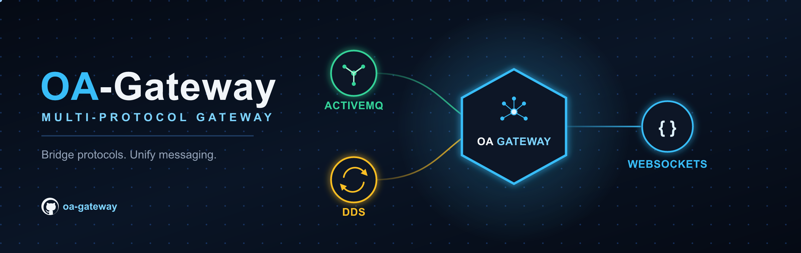

# OA-Gateway



## Introduction

OA-Gateway is an independent prototype: a multi-protocol connector implemented in Rust. It is open source and free to use under the MIT License. It is not an [Open Arsenal](https://gitlab.com/open-arsenal/) project; it speaks OMS, UCI, and A-GRA so it can sit next to those systems.

It currently supports WebSocket (OWP), STOMP (ActiveMQ), and DDS (rustdds) adapters. The routing core is protocol-agnostic. Adapters own framing, handshake, and any schema logic. A new protocol is a new adapter; it is not a change to the core.

Goals:

- Compliance with the OMS, UCI, and A-GRA standards.
- Topic- and destination-level routing, so traffic is addressed by name rather than by peer.
- Extensibility: a new protocol is a new adapter.

## Getting started

Clone the repository and build it.

```bash
git clone https://github.com/jburns3141/oa-gateway.git
cd oa-gateway
cargo build --release
```

Start the process with a configuration file. The host starts an adapter for each named table.

```bash
./target/release/oa-gateway config/default.toml
```

There is no authentication and no in-process TLS. Bind loopback, as `config/default.toml` does, or put a reverse proxy in front. See [SECURITY.md](SECURITY.md).

In another terminal, send one message through the engine:

```bash
cargo run -p oa-gateway-bench --release -- ping --url ws://127.0.0.1:9000/
```

That does INIT (`002.5.0`), SUB `Ping` on `demo`, PUB `{"Ping":{"n":1}}`, waits for MSG, and exits 0.

To run the gateway in Docker, pass a configuration path:

```bash
OAG_CONFIG=$PWD/config/compose.toml docker compose -f compose/gateway.yml up --build
```

That serves OWP at `ws://127.0.0.1:9000/`. A local ActiveMQ broker is a separate stack (`compose/activemq.yml`). See [docs/connecting-active-mq.md](docs/connecting-active-mq.md).

## Standards

UCI, OMS, and A-GRA XSD documents are not in the tree. [`scripts/fetch-uci-schema.sh`](scripts/fetch-uci-schema.sh) writes a gitignored `schema/`. Tests use a fixture schema. The [Dockerfile](Dockerfile) fetches UCI 2.5 at image build. See [docs/using-custom-xsd.md](docs/using-custom-xsd.md).

## Config

A config is a TOML file passed as the only argument: one section per adapter, plus `[uci]` for the schema and `[engine]` for host reporting. Naming an adapter table turns it on; omitting it leaves it off. Settings you leave out fall back to built-in defaults; settings the gateway does not recognize are rejected at startup. The full key list, defaults, and shipped examples are in [docs/configuration.md](docs/configuration.md).

## Documentation

- [docs/glossary.md](docs/glossary.md) — acronyms and OA-Gateway's own vocabulary
- [docs/architecture.md](docs/architecture.md) — crates, routing, and an example path
- [docs/configuration.md](docs/configuration.md) — TOML sections, keys, and defaults
- [docs/writing-an-adapter.md](docs/writing-an-adapter.md) — adding a protocol
- [docs/using-custom-xsd.md](docs/using-custom-xsd.md) — running against a custom message set
- [docs/connecting-active-mq.md](docs/connecting-active-mq.md) — bridging an ActiveMQ broker
- [docs/connecting-dds.md](docs/connecting-dds.md) — joining a DDS domain
- [docs/benchmarking.md](docs/benchmarking.md) — latency and throughput utility, plus the CI `bench` artifact
- rustdoc — crate APIs, including the host binary's modules. Build locally with `cargo doc --workspace --no-deps --document-private-items --open`. CI builds the same tree on every run; download the `rustdoc` artifact. A public default branch also publishes GitHub Pages. A private repository on a free plan cannot. `oa-gateway-adapter` includes a runnable minimal adapter.

## FAQs

1. [STOMP, UCI, ASB? What do all these terms mean?](docs/glossary.md)
1. [How is the gateway put together?](docs/architecture.md)
1. [How do I configure the gateway?](docs/configuration.md)
1. [How can I add a new protocol?](docs/writing-an-adapter.md)
1. [How can I use my own XSD?](docs/using-custom-xsd.md)
1. [How can I connect an ActiveMQ broker?](docs/connecting-active-mq.md)
1. [How can I join a DDS domain?](docs/connecting-dds.md)

## Contributing

See [CONTRIBUTING.md](CONTRIBUTING.md).

## Changelog

Notable changes are in [CHANGELOG.md](CHANGELOG.md).

## License

Licensed under the [MIT License](LICENSE) (copyright John Henry Burns). Open source and free to use.
