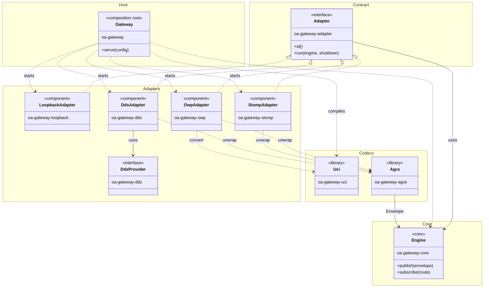
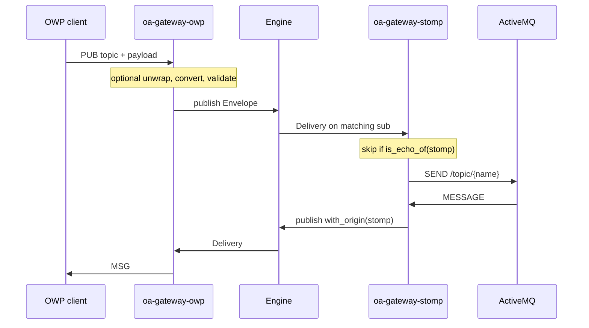

# Architecture

OA-Gateway routes messages between protocols in a single process. The engine matches envelopes by topic and does not parse payloads. Each protocol is an adapter that translates its own frames and communicates only through that engine. A new protocol is a new adapter; it is not a change to `oa-gateway-core`.

The adapter contract is in [writing-an-adapter.md](writing-an-adapter.md), terms are in [glossary.md](glossary.md), and configuration keys are in [configuration.md](configuration.md).

## Layers

The diagram is a UML component view. Each package is a layer. A hollow triangle means the type realizes `Adapter`, a solid arrow is a use, and a dashed arrow is a start or an optional dependency.

| Crate | Role | Depends on |
|---|---|---|
| `oa-gateway-core` | Payload-blind pub/sub: `Envelope`, `RouteKey`, and `Engine`. | tokio |
| `oa-gateway-adapter` | The `Adapter` trait: `id` and `run(engine, shutdown)`. | core |
| `oa-gateway-uci` | XSD compilation, JSON ↔ XML conversion, and validation. A library, not an adapter. | none of the workspace crates at runtime |
| `oa-gateway-agra` | Peel and wrap `MA_RxDataPayload` / `MA_TxDataPayloadCommand`. A library. | core |
| `oa-gateway-loopback` | In-process peer with no socket. | adapter and core |
| `oa-gateway-owp` | WebSocket server: framing, per-connection subscriptions, optional convert/validate, and reconnect. | adapter, core, uci, and agra |
| `oa-gateway-stomp` | STOMP 1.2 client toward a broker, including echo skip and reconnect. | adapter, core, and agra |
| `oa-gateway-dds` | DDS participant: engine topic equals DDS topic, A-GRA Rx/Tx samples, rustdds provider, optional validate and reconnect. | adapter, core, uci, and agra |
| `oa-gateway` | Composition root: load TOML, compile the schema, resolve addresses, and spawn `run`. | every runtime crate |
| `oa-gateway-testing` | Cross-engine tests and harnesses. Adapter crates must not depend on it. | optional and one-way |

`oa-gateway-uci` does not depend on the engine, so the schema codec can be used without a router. The engine sees XML or JSON bytes and a route. It never sees a `Message` tree.

## Envelopes and routing

An [`Envelope`](../crates/oa-gateway-core/src/envelope.rs) carries an id, a [`RouteKey`](../crates/oa-gateway-core/src/route.rs) (topic plus an optional `type_hint`), string headers, a content-type label, and an opaque `Bytes` payload. The engine reads only the route.

A publish with `type_hint: Some("Ping")` is delivered to both `typed(topic, "Ping")` and `topic(topic)` subscribers. Fan-out uses `try_send`: a full subscriber loses that delivery instead of blocking the publisher. Drops are counted in `EngineStats`, and the host logs those counters on `[engine] stats_interval_secs`.

Headers are namespaced by owner (`oag.*`, `stomp.*`, `agra.*`). The `oag.*` constants live in core. The engine does not interpret header values.

## Message flow

`config/asb.toml` is the two-adapter path: OWP on one side and a STOMP client toward a broker on the other. One OWP adapter id covers every WebSocket connection. STOMP is a single client session on the bus. `config/dds.toml` is the same idea on a DDS domain: loopback plus one rustdds participant. The sample type is A-GRA Rx/Tx; the DDS topic name is the engine topic.

Inbound MESSAGE frames are stamped with `oag.origin_adapter`. When `suppress_echo` is on, outbound SEND skips envelopes that originated on this adapter. The engine does not skip by origin. OWP uses one adapter id for every WebSocket, so a core-level origin skip would hide a message from other clients on the same server.

Conversion (JSON ↔ XML) runs only in OWP. Validation runs in OWP and DDS; the host hands `[uci].schema` and `validate` to both. STOMP forwards bytes to ActiveMQ; Java CAL peers already speak XML on that bus. With `xml_baseline`, the WebSocket side is OMS JSON while the engine and the broker see UCI XML.

TLS terminates at the socket, in the adapter, and is opt-in per adapter. OWP terminates it as a server when `owp.tls_cert`/`owp.tls_key` are set; STOMP originates it as a client when `stomp.tls` is set, verifying the broker against `stomp.tls_ca` or the operating system trust store. Neither the engine nor the codecs ever see a wrapped stream: `oa-gateway-adapter`'s `MaybeTlsStream` is what OWP's `Session` and STOMP's `FrameReader`/`FrameWriter` hold instead of a bare `TcpStream`, and its plaintext variant is exactly what a deployment with no certificate/CA configured uses. DDS is not a candidate for this — RTPS runs on UDP, not a TCP stream — so its equivalent is DDS Security, which this build does not configure.

## Host

The binary owns process lifetime. It does not implement a protocol.

1. Parse the command line: one config path, or `--help` / `--version`.
2. Load the TOML file. An unknown key is a startup error. A named adapter table is on; an omitted table is off.
3. Compile `[uci].schema` before any adapter listens.
4. Resolve `owp.bind` and `stomp.broker`. DDS has no hostname; `[dds] qos` is checked as a path.
5. Spawn each enabled adapter's `run` on the shared `Engine` and a cancellation token.
6. Log engine counters until Ctrl-C, then cancel and join every task.

If `run` returns `Err`, that adapter is down. The host logs the error and leaves the others running. It does not restart a finished `run`. STOMP, OWP, and DDS each retry inside their own loop, built on the same `after_join`/`OnPanic` decision in `oa-gateway-adapter`; `on_panic` on each one chooses abort or reconnect after a session panic. Loopback has no session and no `on_panic` key — nothing in it can fail or panic in normal operation.

`src/config/` and `src/adapters/` name loopback, OWP, STOMP, and DDS. A new protocol is a crate plus a host section, not a dynamically loaded plugin. The DDS crate talks to rustdds only through a `DdsProvider` trait so a later vendor stack is another implementation, not a change to the adapter.

## Libraries

`oa-gateway-uci` and `oa-gateway-agra` are codecs. Adapters depend on them; they are not adapters and they do not own a socket.

- **UCI** compiles XSD, converts JSON ↔ XML, and reports schema violations. Conversion is forgiving; validation is a separate pass. See [using-custom-xsd.md](using-custom-xsd.md).
- **A-GRA** unwraps an Rx/Tx hex payload so subscribers can route on the inner message type. OWP, STOMP, and DDS call it when `unwrap_ma_payloads` is on. DDS samples carry the inner bytes already decoded; `unwrapped_from_parts` builds the same wrapper and inner envelopes without serializing to XML first. Platform-facing A-GRA interfaces use native message types and do not use this crate.

## Design constraints

- **The core does not parse payloads and does not name a protocol.** Logic that depends on the meaning of the bytes belongs in an adapter or a codec crate.
- **Adapters do not call each other.** They share an `Engine`, which is what makes them independently testable and removable.
- **Echo suppression is the bridging adapter's responsibility.** A new bus adapter must stamp origin and skip its own id the same way STOMP does. The engine will not do it.
- **The gateway can terminate TLS but does not authenticate its own peers.** TLS covers encryption and proving the gateway's identity to a peer, nothing about the peer's identity or what it may do — OWP frame, connection, and subscription limits are still what isolate one client from the others. [SECURITY.md](../SECURITY.md) states the assumptions.

## Further reading

| Task | Document |
|---|---|
| Implement a protocol | [writing-an-adapter.md](writing-an-adapter.md) and the Echo doc-test in `oa-gateway-adapter` |
| Change a configuration key | [configuration.md](configuration.md) |
| Bridge ActiveMQ | [connecting-active-mq.md](connecting-active-mq.md) |
| Join a DDS domain | [connecting-dds.md](connecting-dds.md) |
| Browse crate APIs | `cargo doc --workspace --no-deps --document-private-items --open` |
